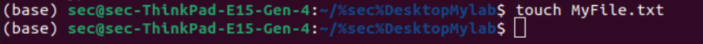
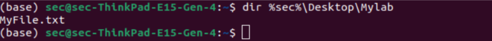
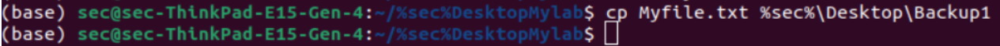

# Windows-basic-commands-batchscript
Ex08-Windows-basic-commands-batchscript

# AIM:
To execute Windows basic commands and batch scripting

# DESIGN STEPS:

### Step 1:

Navigate to any Windows environment installed on the system or installed inside a virtual environment like virtual box/vmware 

### Step 2:

Write the Windows commands / batch file
Save each script in a file with a .bat extension.
Ensure you have the necessary permissions to perform the operations.
Adapt paths as needed based on your system configuration.
### Step 3:

Execute the necessary commands/batch file for the desired output. 


# WINDOWS COMMANDS:
## Exercise 1: Basic Directory and File Operations
Create a directory named "MyLab" on the desktop.

```bash
mkdir %userprofile%\Desktop\MyLab
```


Change to the "MyLab" directory and create an empty text file named "MyFile.txt" inside it.


## COMMAND AND OUTPUT

List the contents of the "MyLab" directory.

```bash
cd %userprofile%\Desktop\MyLab
```




## COMMAND AND OUTPUT

Copy "MyFile.txt" to a new folder named "Backup" on the desktop.

```bash
dir %userprofile%\Desktop\MyLab
```



## COMMAND AND OUTPUT

Move the "MyLab" directory to the "Documents" folder.

```bash
mkdir %userprofile%\Desktop\Backup

copy MyFile.txt %userprofile%\Desktop\Backup
```




## COMMAND AND OUTPUT
```
mv Myfile.txt %userprofile%\Documents
```


## Exercise 2: Advanced Batch Scripting
Create a batch script named "BackupScript.bat" that creates a backup of files with the ".docx" extension from the "Documents" folder to a new folder named "DocBackup" on the desktop.

```bash
@echo off
mkdir %userprofile%\Desktop\DocBackup
copy %userprofile%\Documents\*.docx %userprofile%\Desktop\DocBackup
echo Backup completed successfully!
```

Modify the script to delete files with the ".docx" extension from the "Documents" folder after creating the backup.

```bash
@echo off
mkdir %userprofile%\Desktop\DocBackup
copy %userprofile%\Documents\*.docx %userprofile%\Desktop\DocBackup
del %userprofile%\Documents\*.docx
echo Backup and deletion completed successfully!
```

## OUTPUT


# RESULT:
The commands/batch files are executed successfully.

